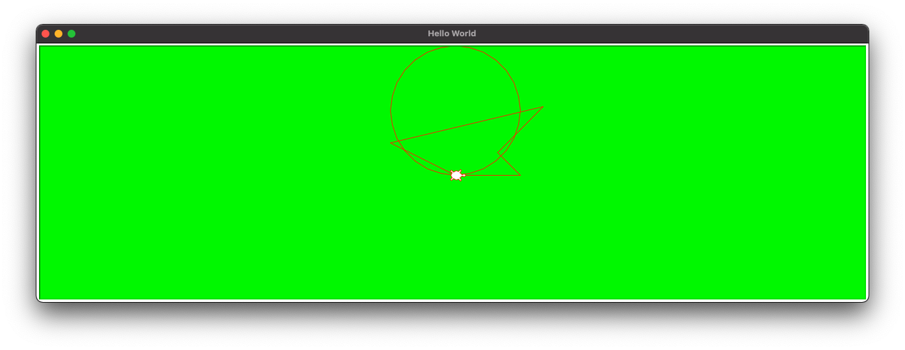

# The turtle library

<TagLinks />

[`turtle`](https://docs.python.org/3/library/turtle.html) is a standard Python library that allows you to create shapes and drawings in a virtual canvas.
Imagine you start at (0, 0) in a x-y plane.
With the help of `turtle` library, you can move a virtual pen to draw lines and fill with colors to make creative drawings.

Let's see how it goes in action.

## Getting started

Simply import turtle to get started.
Take a look at the example from the Python docs and get the feeling of what `turtle` can offer.

```python
import turtle

turtle.color('red', 'yellow')
turtle.begin_fill()

while True:
    turtle.forward(200)
    turtle.left(170)
    if abs(turtle.pos()) < 1:
        break

turtle.end_fill()
```

Now let's learn the basics of `turtle`.

## Screen

```python
import turtle

screen = turtle.getscreen()
screen.title("Hello World")
screen.setup(width=.5,height=400)
```


[`turtle.getscreen()`](https://docs.python.org/3/library/turtle.html#turtle.getscreen) will show the interactive canvas. You can see the triangular figure ("turtle") in the middle of the screen. That's where our virtual penpoint locates.

We can set the title using [`title()`](https://docs.python.org/3/library/turtle.html#turtle.title) and change the size of screen using [`setup()`](https://docs.python.org/3/library/turtle.html#turtle.setup).

```python
screen.bgcolor("green")
```


We can also change the background color using [`bgcolor()`](https://docs.python.org/3/library/turtle.html#turtle.bgcolor)

## Turtle

```python
t = turtle.getturtle()
t.shape("turtle")
```


You can get the default turtle using [`turtle.getturtle()`](https://docs.python.org/3/library/turtle.html#turtle.getturtle). [`shape()`](https://docs.python.org/3/library/turtle.html#turtle.shape) can change the default triangular shape to your liking. Available options include "arrow", "turtle", "circle", "square", "triangle", and "classic".

```python
t.pencolor("red")
t.fillcolor("white")
```


You can further customize the appearance of the turtle using [`pencolor()`](https://docs.python.org/3/library/turtle.html#turtle.pencolor) and [`fillcolor()`](https://docs.python.org/3/library/turtle.html#turtle.fillcolor).

In fact, `pencolor()` also determines the color of the trace and `fillcolor()` would change the color of a filled shape. See the examples below.

### Moving

The turtle can move [forward()](https://docs.python.org/3/library/turtle.html#turtle.forward) or [backward()](https://docs.python.org/3/library/turtle.html#turtle.backward) in the direction that it's facing. It can also turn to the [left()](https://docs.python.org/3/library/turtle.html#turtle.left) or [right()](https://docs.python.org/3/library/turtle.html#turtle.right) by a specific degree.
By default, the turtle will draw when it moves.
Check the commands and the associated results.

---

First, we move the turtle forward by 100.

```python
t.forward(100)
```


---

Then, we turn the turtle to the right by 45 degrees. Notice the turtle head turned.

```python
t.right(45)
```


---

Next, we move backward by 50.

```python
t.backward(50)
```


---

This time, we turn the turtle to the left by 90 degrees. See the turtle head now is pointing to upper right.

```python
t.left(90)
```


---

Lastly the turtle continues to move forward by 100

```python
t.forward(100)
```


---

We can also move the turtle to a certain coordinate using [`goto()`](https://docs.python.org/3/library/turtle.html#turtle.goto).

```python
t.goto(-100, 50)
```


---

And `home()` will send the turtle back to the initial location.

```python
t.home()
```


---

[`circle()`](https://docs.python.org/3/library/turtle.html#turtle.circle) would make the turtle move in circle.

```python
t.circle(100)
```



---

By the way, we can also control the [speed()](https://docs.python.org/3/library/turtle.html#turtle.speed) in which the turtle moves.

```python
t.speed(1)
t.circle(20)
t.speed(10)
t.circle(40)
```


### Filling

When wrapped by `begin_fill()` and `end_fill()`, the area determined by the path of the turtle's movement will be filled with color.

Let's use some of the previous movements for example.

---

```python
import turtle

screen = turtle.getscreen()
screen.title("Hello World")
screen.setup(width=.5,height=400)
screen.bgcolor("green")

t = turtle.getturtle()
t.shape("turtle")
t.pencolor("blue")
t.pencolor("red")
t.fillcolor("white")

turtle.begin_fill()
t.forward(100)
t.right(45)
t.backward(50)
t.left(90)
t.forward(100)
t.goto(-100, 50)
turtle.end_fill()
```


Notice that a straight imaginary line will draw automatically if the ending location is different from the initial one.

---

We can as well control the pen size using [pensize()](https://docs.python.org/3/library/turtle.html#turtle.pensize).

```python
t.pensize(10)

turtle.begin_fill()
t.circle(60)
turtle.end_fill()
```


---

### Multiple Turtles

We can create additional turtles if needed.

```python
import turtle

screen = turtle.getscreen()
screen.title("Hello World")
screen.setup(width=.5,height=400)
screen.bgcolor("green")
t1 = turtle.getturtle()
t2 = turtle.Turtle()

t1.shape("turtle")
t2.shape("arrow")

t1.goto(100, 100)
t2.goto(100, -100)
```


### Moving without drawing

The turtle will not draw if we lift the pen up. To resume drawing, simply pen down.

```python
import turtle

screen = turtle.getscreen()
screen.title("Hello World")
screen.setup(width=.5,height=400)
screen.bgcolor("green")

t = turtle.getturtle()
t.penup()
t.goto(100, 100)
t.pendown()
t.backward(100)
t.home()
```


## Assignment 15

Create a Python script named `turtle_square.py` which draws a red square with length of 100.

::: tip Canvas closing too soon?

Add `turtle.done()` at the end of script so that the canvas won't close automatically.

:::

The drawing would look like as below.


::: details Sample Solution

<<< @/lesson/assignments/turtle_square.py

:::

## Assignment 16

Create a Python script named `turtle_triangle.py` which draws a green triangle with vertices at (0,0), (100, 40), and (-50, 80).

The drawing would look like as below.


::: details Sample Solution

<<< @/lesson/assignments/turtle_triangle.py

:::

## Assignment 17

Create a Python script named `turtle_race.py` which simulates a race between two turtles, a blue turtle and a green one. The first to move 200 forward would win the race. The race is turn by turn.
In each turn both turtles roll a dice to determine how far they move forward. For example, if the blue turtle rolls a six, it moves 6 forward.

Also show the winner at the title bar when the race ends.

The drawing would look like as below on completion.


::: details Sample Solution

<<< @/lesson/assignments/turtle_race.py

:::
