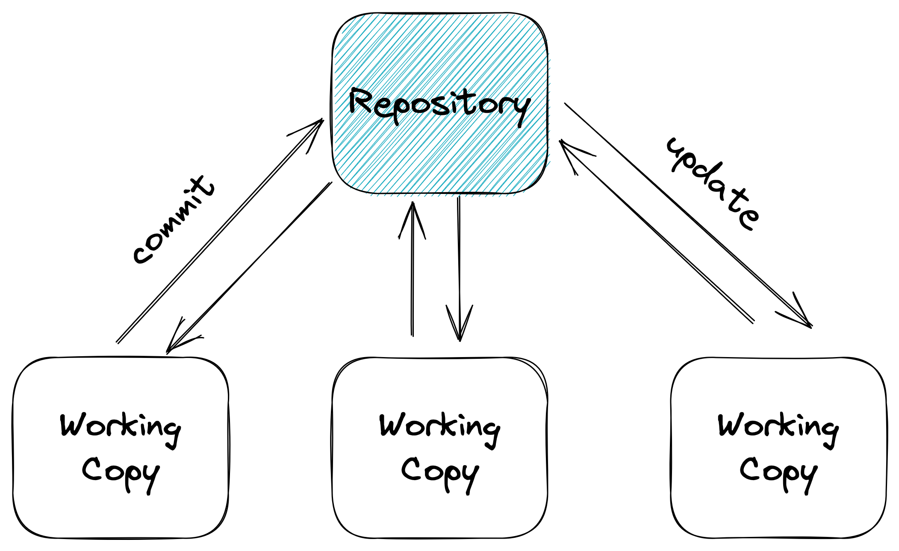
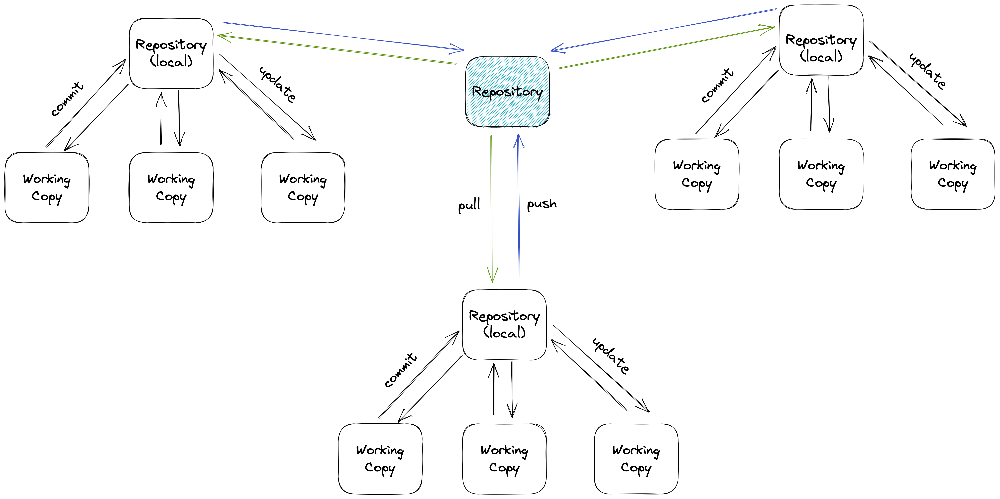

# Version Control

<TagLinks />

We have been coding for quite some time, mostly on our own at our own machines.
However, it's common to work with colleagues on the same project when we join the workforce in future.
To facilitate the managing of file edits, we usually use some version control systems.

> A version control system serves the following purposes, among others.
>
> - Version control enables multiple people to simultaneously work on a single project. Each person edits his or her own copy of the files and chooses when to share those changes with the rest of the team. Thus, temporary or partial edits by one person do not interfere with another person's work. Version control also enables one person you to use multiple computers to work on a project, so it is valuable even if you are working by yourself.
>
> - Version control integrates work done simultaneously by different team members. In most cases, edits to different files or even the same file can be combined without losing any work. In rare cases, when two people make conflicting edits to the same line of a file, then the version control system requests human assistance in deciding what to do.
> - Version control gives access to historical versions of your project. This is insurance against computer crashes or data lossage. If you make a mistake, you can roll back to a previous version. You can reproduce and understand a bug report on a past version of your software. You can also undo specific edits without losing all the work that was done in the meanwhile. For any part of a file, you can determine when, why, and by whom it was ever edited.

References:

- [Version control concepts and best practices](https://homes.cs.washington.edu/~mernst/advice/version-control.html)
- [What is version control: centralized vs. DVCS](https://www.atlassian.com/blog/software-teams/version-control-centralized-dvcs)

## Two types of version control systems

### Centralized Version Control System



> Centralized version control systems are based on the idea that there is a single “central” copy of your project somewhere (probably on a server), and programmers will “commit” their changes to this central copy.

Subversion (or SVN) is a well-known centralized version control system.

### Distributed Version Control System



> Distributed version control systems do not necessarily rely on a central server to store all the versions of a project’s files. Instead, every developer “clones” a copy of a repository and has the full history of the project on their own hard drive. This copy (or “clone”) has all of the metadata of the original.

[Git](https://git-scm.com) is a well-known distributed version control system.

## A Typical Workflow

In order to have _Git_ working properly, we need to define the author name and email.

```sh
git config --global user.name "<name>"
git config --global user.email "<email>"
```

1. When we start working on a new project, create empty Git repo in the current directory.

```sh
git init .
```

2. List which files are staged, unstaged, or untracked.

```sh
git status
```

3. To access the history, we display the commit history.

```sh
git log
```

4. When we are ready to put some edits in history, we stage the changes.

```sh
git add .
```

or

```sh
git add <some-file>
```

5. Commit the staged snapshot and use \<message\> as the commit message.

```sh
git commit -m "<message>"
```

If we use [GitHub](https://github.com) for our remote repository, we set it up by adding a remote url.

```sh
git remote add <name> <url>
```

where \<name\> is an arbitrary label for the remote sever, and \<url\> is the address of that remote server.

And we can push to the remote for the first time

```sh
git push -u <name> <branch_name>
```

Later on, we can simply

```sh
git push
```

VS Code has a [Source Control](https://code.visualstudio.com/docs/editor/versioncontrol) tab to work with Git using a simple GUI. We will demo it in class.

[GitLens](https://marketplace.visualstudio.com/items?itemName=eamodio.gitlens) and [Version Lens](https://marketplace.visualstudio.com/items?itemName=pflannery.vscode-versionlens) are two handy extensions we can install to work with Git.

## Version Control Best Practices

- Use a descriptive commit message
- Make each commit a logical unit
- Avoid indiscriminate commits
- Incorporate others' changes frequently
- Share your changes frequently
- Coordinate with your co-workers
- Remember that the tools are line-based
- Don't commit generated files
